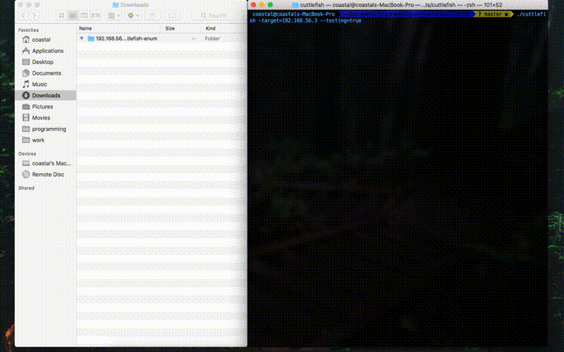

# cuttlefish

**cuttlefish** has morphed from my original intention of a host-distributed webapp enumeration tool, into an automated scanning tool for single-host penetration testing. I am going to enroll in OffSec's PWK to prepare for taking the OSCP, and want to have a tool that will help me perform automated host enumeration. Additionally, I wanted to learn `go` from a practical project PoV.



### installation

An automated install script has been setup for linux (only tested on 64-bit Kali)

```
./linux_install.sh
```

If you would like to install on a mac, install `go`, and perform the steps from the install script (post golang-installation) one at a time.

### example enumeration

```
$ ./cuttlefish -target=192.168.56.3
-------------.__   ,+-.           ,+ ~.     ,-----------
           O  o `- o ,-`           `.o `._./            
o   O   o   o _O  o /   cuttlefish   \ O  o    O   o   O
__o___O____,-`  `\_*         v0.0     \._____o___coastal
[~] supports: ssh, smtp, ftp, http, https, smb, ms-sql
[*] run options
	[*] logging to /root/Downloads/192.168.56.3-cuttlefish-enum
	[*] target:		192.168.56.3
[+] root privs enabled (GUID: 0), script scanning with nmap
[*] starting intial nmap recon scan
	[+] scan: nmap-udp-recon	[port:all]	(complete)	[time elapsed: 0.68s]
	[+] scan: nmap-tcp-recon	[port:all]	(complete)	[time elapsed: 148.62s]
[+] identified running services
	[+] ftp (21)
	[+] ssh (22)
	[+] telnet (23)
	[+] smtp (25)
	[+] domain (53)
	[+] http (80)
	[+] rpcbind (111)
	[+] netbios-ssn (139)
	[+] netbios-ssn (445)
	[+] exec (512)
	[+] login (513)
	[+] shell (514)
	[+] java-rmi (1099)
	[+] shell (1524)
	[+] nfs (2049)
	[+] ftp (2121)
	[+] mysql (3306)
	[+] distccd (3632)
	[+] postgresql (5432)
	[+] vnc (5900)
	[+] X11 (6000)
	[+] irc (6667)
	[+] irc (6697)
	[+] ajp13 (8009)
	[+] http (8180)
	[+] drb (8787)
	[+] status (33570)
	[+] mountd (37117)
	[+] nlockmgr (44137)
	[+] unknown (59679)
[*] starting follow up scans on identified services
	[+] scan: http-curl-scan	[port:80]	(complete)	[time elapsed: 0.00s]
	[+] scan: smtp-user-enum	[port:25]	(complete)	[time elapsed: 0.42s]
	[+] scan: http-curl-scan	[port:8180]	(complete)	[time elapsed: 0.42s]
	[+] scan: smtp-nmap-enum	[port:25]	(complete)	[time elapsed: 6.63s]
	[+] scan: ftp-nmap-scan		[port:21]	(complete)	[time elapsed: 6.98s]
	[+] scan: ftp-nmap-scan		[port:2121]	(complete)	[time elapsed: 8.17s]
	[!] scan: hydra-ftp-brute	[port:21]	(error)		[time elapsed: 10.81s]
	[+] scan: nikto-scan		[port:8180]	(complete)	[time elapsed: 22.12s]
	[+] scan: nikto-scan		[port:80]	(complete)	[time elapsed: 22.38s]
	[+] scan: http-nmap-scan	[port:80]	(complete)	[time elapsed: 31.84s]
	[+] scan: http-nmap-scan	[port:8180]	(complete)	[time elapsed: 42.62s]
	[+] scan: gobuster-dir-enum	[port:80]	(complete)	[time elapsed: 96.23s]
	[+] scan: gobuster-dir-enum	[port:8180]	(complete)	[time elapsed: 96.86s]
	[!] scan: hydra-ssh-brute	[port:22]	(error)		[time elapsed: 156.67s]
	[!] scan: hydra-ftp-brute	[port:2121]	(error)		[time elapsed: 1150.12s]
[+] cuttlefish enumeration of 192.168.56.3 complete!
	[+] total time: 21.65 mins
```

### log files

```
$tree ~/Downloads/192.168.56.3-cuttlefish-enum
192.168.56.3-cuttlefish-enum
├── 192.168.56.3-cuttlemain-2018-01-23-[truncated].cuttlelog
├── 192.168.56.3-ftp-nmap-scan-[port:2121]-2018-01-23-[truncated].cuttlelog
├── 192.168.56.3-ftp-nmap-scan-[port:21]-2018-01-23-[truncated].cuttlelog
├── 192.168.56.3-gobuster-dir-enum-[port:80]-2018-01-23-[truncated].cuttlelog
├── 192.168.56.3-gobuster-dir-enum-[port:8180]-2018-01-23-[truncated].cuttlelog
├── 192.168.56.3-http-curl-scan-[port:80]-2018-01-23-[truncated].cuttlelog
├── 192.168.56.3-http-curl-scan-[port:8180]-2018-01-23-[truncated].cuttlelog
├── 192.168.56.3-http-nmap-scan-[port:80]-2018-01-23-[truncated].cuttlelog
├── 192.168.56.3-http-nmap-scan-[port:8180]-2018-01-23-[truncated].cuttlelog
├── 192.168.56.3-hydra-ftp-brute-[port:2121]-2018-01-23-[truncated].cuttlelog
├── 192.168.56.3-hydra-ftp-brute-[port:21]-2018-01-23-[truncated].cuttlelog
├── 192.168.56.3-hydra-ssh-brute-[port:22]-2018-01-23-[truncated].cuttlelog
├── 192.168.56.3-nikto-scan-[port:80]-2018-01-23-[truncated].cuttlelog
├── 192.168.56.3-nikto-scan-[port:8180]-2018-01-23-[truncated].cuttlelog
├── 192.168.56.3-nmap-tcp-recon-[port:all]-2018-01-23-[truncated].cuttlelog
├── 192.168.56.3-nmap-udp-recon-[port:all]-2018-01-23-[truncated].cuttlelog
├── 192.168.56.3-smtp-nmap-enum-[port:25]-2018-01-23-[truncated].cuttlelog
└── 192.168.56.3-smtp-user-enum-[port:25]-2018-01-23-[truncated].cuttlelog

```

### example logfile contents

```
cat '192.168.56.3-http-nmap-scan-[port:8180]-2018-01-23 17:42:36.171148434 -0500 EST m=+0.000271201-.cuttlelog'

Starting Nmap 7.60 ( https://nmap.org ) at 2018-01-23 17:45 EST
Nmap scan report for 192.168.56.3
Host is up (0.0084s latency).

PORT     STATE SERVICE VERSION
8180/tcp open  http    Apache Tomcat/Coyote JSP engine 1.1
| http-default-accounts: 
|   [Apache Tomcat] at /manager/html/
|_    tomcat:tomcat
|_http-devframework: Couldn't determine the underlying framework or CMS. Try increasing 'httpspider.maxpagecount' value to spider more pages.
| http-enum: 
|   /admin/: Possible admin folder
|   /admin/index.html: Possible admin folder
|   /admin/login.html: Possible admin folder
|   /admin/admin.html: Possible admin folder
|   /admin/account.html: Possible admin folder
|   /admin/admin_login.html: Possible admin folder
|   /admin/home.html: Possible admin folder
|   /admin/admin-login.html: Possible admin folder
|   /admin/adminLogin.html: Possible admin folder
|   /admin/controlpanel.html: Possible admin folder
|   /admin/cp.html: Possible admin folder
|   /admin/index.jsp: Possible admin folder
|   /admin/login.jsp: Possible admin folder
|   /admin/admin.jsp: Possible admin folder
|   /admin/home.jsp: Possible admin folder
|   /admin/controlpanel.jsp: Possible admin folder
|   /admin/admin-login.jsp: Possible admin folder
|   /admin/cp.jsp: Possible admin folder
|   /admin/account.jsp: Possible admin folder
|   /admin/admin_login.jsp: Possible admin folder
|   /admin/adminLogin.jsp: Possible admin folder
|   /manager/html/upload: Apache Tomcat (401 Unauthorized)
|   /manager/html: Apache Tomcat (401 Unauthorized)
|   /admin/view/javascript/fckeditor/editor/filemanager/connectors/test.html: OpenCart/FCKeditor File upload
|   /admin/includes/FCKeditor/editor/filemanager/upload/test.html: ASP Simple Blog / FCKeditor File Upload
|   /admin/jscript/upload.html: Lizard Cart/Remote File upload
|_  /webdav/: Potentially interesting folder
| http-methods: 
|_  Supported Methods: GET HEAD POST OPTIONS
|_http-server-header: Apache-Coyote/1.1
| http-vhosts: 
|_127 names had status 200

Service detection performed. Please report any incorrect results at https://nmap.org/submit/ .
Nmap done: 1 IP address (1 host up) scanned in 42.27 seconds
```