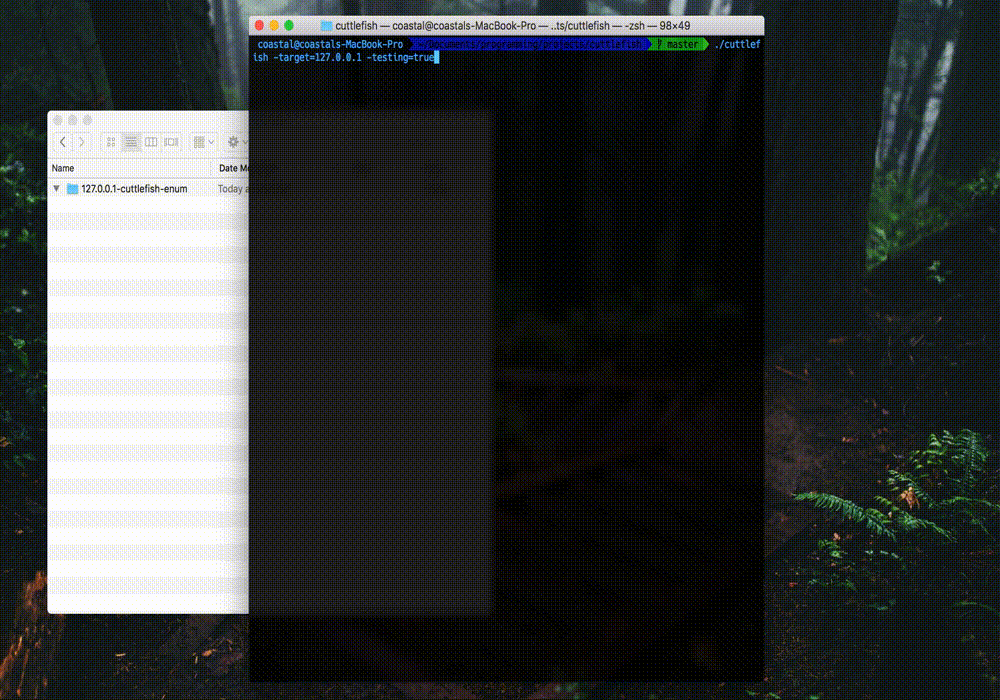

# cuttlefish

**cuttlefish** has morphed from my original intention of a host-distributed webapp enumeration tool, into an automated scanning tool for single-host penetration testing. I am going to enroll in OffSec's PWK to prepare for taking the OSCP, and want to have a tool that will help me perform automated host enumeration. Additionally, I wanted to learn `go` from a practical project PoV.



### installation

An automated install script has been setup for linux (only tested on 64-bit Kali)

```
./linux_install.sh
```

If you would like to install on a mac, install `go`, and perform the steps from the install script (post golang-installation) one at a time.

### TODOs:

- [x] Implement `unicornscan` as initial port discovery tool instead of `nmap` to increase speed


### example enumeration

```
$./cuttlefish -target=127.0.0.1 -testing=true
$-------------.__   ,+-.           ,+ ~.     ,-----------
           O  o `- o ,-`           `.o `._./            
o   O   o   o _O  o /   cuttlefish   \ O  o    O   o   O
__o___O____,-`  `\_*         v0.0     \._____o___coastal
[~] supports identification and enumeration of: 
	ftp, ssh, telnet, smtp, snmp, ftp, http, https
	smb, ms-sql, rdp
[*] running in test mode
[*] run options
	[*] logging to /Users/coastal/Documents/oscp/labs
	[*] target:		127.0.0.1
[!] not executed as root (GUID: 501), script scanning not performed
[*] starting intial nmap recon scan
	[+] scan: nmap-tcp-recon	[port:all]	(complete)	[time elapsed: 0.91s]
[+] identified running services
	[+] ftp (21)
	[+] ssh (22)
	[+] telnet (23)
	[+] smtp (25)
	[+] domain (53)
	[+] http (80)
	[+] rpcbind (111)
	[+] netbios-ssn (139)
	[+] microsoft-ds (445)
	[+] exec (512)
	[+] login (513)
	[+] shell (514)
	[+] rmiregistry (1099)
	[+] ingreslock (1524)
	[+] nfs (2049)
	[+] ccproxy-ftp (2121)
	[+] mysql (3306)
	[-] ms-wbt-server (3389)
	[+] postgresql (5432)
	[+] vnc (5900)
	[+] X11 (6000)
	[+] irc (6667)
	[+] ajp13 (8009)
	[+] unknown (8180)
[*] starting follow up scans on identified services
	[!] scan: telnet-banner		[port:23]	(error)		[time elapsed: 0.00s]
	[!] scan: smtp-user-enum	[port:25]	(error)		[time elapsed: 0.06s]
	[!] scan: http-curl-scan	[port:80]	(error)		[time elapsed: 0.00s]
	[!] scan: robots-txt-scan	[port:80]	(error)		[time elapsed: 0.00s]
	[+] scan: ftp-nmap-scan		[port:21]	(complete)	[time elapsed: 0.96s]
	[+] scan: smtp-nmap-enum	[port:25]	(complete)	[time elapsed: 0.96s]
	[+] scan: http-nmap-scan	[port:80]	(complete)	[time elapsed: 0.96s]
	[+] scan: smb-nmap-vuln		[port:445]	(complete)	[time elapsed: 0.96s]
	[+] scan: smb-nmap-enum		[port:445]	(complete)	[time elapsed: 0.96s]
	[+] scan: gobuster-dir-enum	[port:80]	(complete)	[time elapsed: 1.99s]
	[+] scan: gobuster-cgi-enum	[port:80]	(complete)	[time elapsed: 1.99s]
	[+] scan: smb-enumlinux-scan	[port:445]	(complete)	[time elapsed: 3.01s]
	[+] scan: nikto-scan		[port:80]	(complete)	[time elapsed: 4.02s]
	[+] scan: hydra-ftp-brute	[port:21]	(complete)	[time elapsed: 9.90s]
	[+] scan: hydra-ssh-brute	[port:22]	(complete)	[time elapsed: 10.01s]
	[+] scan: hydra-rdp-brute	[port:3389]	(complete)	[time elapsed: 10.01s]
[+] cuttlefish enumeration of 127.0.0.1 complete! (0.19 mins)
```

### log files

```
$ tree ~/Documents/oscp/labs
└── 127.0.0.1-cuttlefish-enum
    └── 2018-01-25T23:23:27-05:00
        ├── 127.0.0.1-cuttlemain.cuttlelog
        ├── 127.0.0.1-port21-ftp-nmap-scan.cuttlelog
        ├── 127.0.0.1-port21-hydra-ftp-brute.cuttlelog
        ├── 127.0.0.1-port22-hydra-ssh-brute.cuttlelog
        ├── 127.0.0.1-port23-telnet-banner.cuttlelog
        ├── 127.0.0.1-port25-smtp-nmap-enum.cuttlelog
        ├── 127.0.0.1-port25-smtp-user-enum.cuttlelog
        ├── 127.0.0.1-port3389-hydra-rdp-brute.cuttlelog
        ├── 127.0.0.1-port445-smb-enumlinux-scan.cuttlelog
        ├── 127.0.0.1-port445-smb-nmap-enum.cuttlelog
        ├── 127.0.0.1-port445-smb-nmap-vuln.cuttlelog
        ├── 127.0.0.1-port80-gobuster-cgi-enum.cuttlelog
        ├── 127.0.0.1-port80-gobuster-dir-enum.cuttlelog
        ├── 127.0.0.1-port80-http-curl-scan.cuttlelog
        ├── 127.0.0.1-port80-http-nmap-scan.cuttlelog
        ├── 127.0.0.1-port80-nikto-scan.cuttlelog
        ├── 127.0.0.1-port80-robots-txt-scan.cuttlelog
        └── 127.0.0.1-portall-nmap-tcp-recon.cuttlelog
```

### example logfile contents

```
cat '192.168.56.3-http-nmap-scan-[port:8180]-2018-01-23 17:42:36.171148434 -0500 EST m=+0.000271201-.cuttlelog'

Starting Nmap 7.60 ( https://nmap.org ) at 2018-01-23 17:45 EST
Nmap scan report for 192.168.56.3
Host is up (0.0084s latency).

PORT     STATE SERVICE VERSION
8180/tcp open  http    Apache Tomcat/Coyote JSP engine 1.1
| http-default-accounts: 
|   [Apache Tomcat] at /manager/html/
|_    tomcat:tomcat
|_http-devframework: Couldn't determine the underlying framework or CMS. Try increasing 'httpspider.maxpagecount' value to spider more pages.
| http-enum: 
|   /admin/: Possible admin folder
|   /admin/index.html: Possible admin folder
|   /admin/login.html: Possible admin folder
|   /admin/admin.html: Possible admin folder
|   /admin/account.html: Possible admin folder
|   /admin/admin_login.html: Possible admin folder
|   /admin/home.html: Possible admin folder
|   /admin/admin-login.html: Possible admin folder
|   /admin/adminLogin.html: Possible admin folder
|   /admin/controlpanel.html: Possible admin folder
|   /admin/cp.html: Possible admin folder
|   /admin/index.jsp: Possible admin folder
|   /admin/login.jsp: Possible admin folder
|   /admin/admin.jsp: Possible admin folder
|   /admin/home.jsp: Possible admin folder
|   /admin/controlpanel.jsp: Possible admin folder
|   /admin/admin-login.jsp: Possible admin folder
|   /admin/cp.jsp: Possible admin folder
|   /admin/account.jsp: Possible admin folder
|   /admin/admin_login.jsp: Possible admin folder
|   /admin/adminLogin.jsp: Possible admin folder
|   /manager/html/upload: Apache Tomcat (401 Unauthorized)
|   /manager/html: Apache Tomcat (401 Unauthorized)
|   /admin/view/javascript/fckeditor/editor/filemanager/connectors/test.html: OpenCart/FCKeditor File upload
|   /admin/includes/FCKeditor/editor/filemanager/upload/test.html: ASP Simple Blog / FCKeditor File Upload
|   /admin/jscript/upload.html: Lizard Cart/Remote File upload
|_  /webdav/: Potentially interesting folder
| http-methods: 
|_  Supported Methods: GET HEAD POST OPTIONS
|_http-server-header: Apache-Coyote/1.1
| http-vhosts: 
|_127 names had status 200

Service detection performed. Please report any incorrect results at https://nmap.org/submit/ .
Nmap done: 1 IP address (1 host up) scanned in 42.27 seconds
```